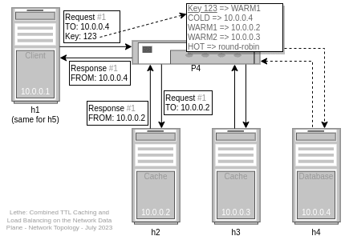
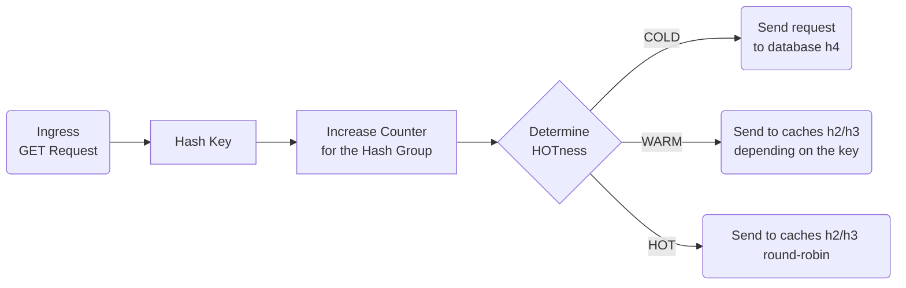
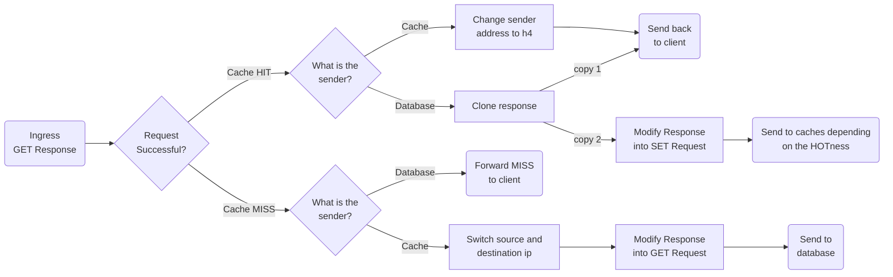
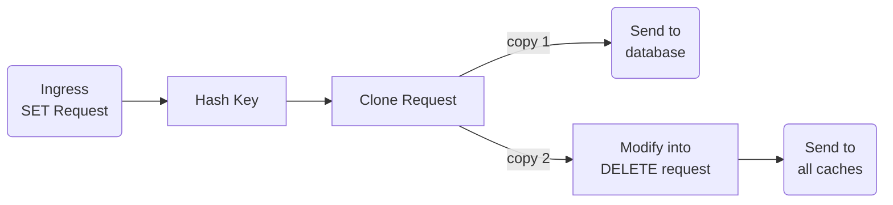
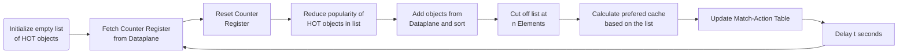

# LETHE: Combined Time-to-Live Caching and Load Balancing on the Network Data Plane

*July 2023, Nehal Baganal-Krishna; David Munstein; Amr Rizk, NCS Research Group, University of Duisburg-Essen*

https://dx.doi.org/10.1109/LANMAN58293.2023.10189809

Lethe is a popularity-based load balancer using a combination of LRU and TTL for key-value stores implemented in P4. It provides transparent caching for object requests, meaning that it is indistinguishable and irrelevant to the client, whether an object is fetched from the database or a cache server.

This repository contains the accompanying source code for the stateful Lethe load balancer implementation used for the evaluation. It is using the software P4 behavioral model [BMV2](https://github.com/p4lang/behavioral-model), [Mininet](https://github.com/mininet/mininet), the virtual software defined network, [p4-utils](https://github.com/nsg-ethz/p4-utils/) and a patched version of [Memcached](https://memcached.org/).


## Lethe Architecture

### Topology




### Protocol

The Lethe protocol is a modified version of the Memcached UDP Text/ASCII protocol where a reserved section of the UDP frame header is used for load balancing and debugging information. Lethe expects a key-length of 44 bytes to work properly.

#### Lethe Header in UDP Frame Header

Bytes | Description
------|------------
0-1   | Request ID. Used for determining the cache server for HOT objects. Pseudo round-robin.
2-3   | Sequence number\*. *Ignored.*
4-5   | Number of datagrams\*. *Ignored.*
6     | Lethe Header: Unused.
7     | **Lethe Header**: `_CCD_HHH` <br/> CC: Cache ID (last 3 bits of cache IPv4 address) <br/> D: Response from database? <br/> HHH: Hotness (0=COLD 1=WARM1 2=HOT 3=WARM2)

\* Requests split into multiple datagrams should work fine as the key and request id will remain the same. However, packet loss can occur if the HOTness of an object changes in the middle of the data transfer.


### Algorithm

#### Dataplane: GET Request




#### Dataplane: GET Response




#### Dataplane: SET Request




#### Controlplane



<p>
<details>
<summary>Expand to view algorithm as textual description</summary>

- **Dataplane (P4)**
  - GET request:
    - Hash key
    - Increase the counter for the hashed key by one
    - Determine HOTness using the match action table:
    - If COLD: Send request to the database (h4)
    - If WARM: Send request to one of the caches (h2,h3) based on the hashed key (same key ⇒ same cache)
    - If HOT: Send request to one of the caches (h2,h3) based on the hashed request id (same key ⇏ same cache)
  - If a requested object is not available on a cache server even though it is WARM/HOT, the switch will request the object from the database and
    - send the response to the requesting client
    - If WARM: Also store it on a single cache based on the hashed key
    - If HOT: Also store it on all cache servers
  - SET request:
    - Hash key
    - Always invalidate (delete) the object on all caches (h2, h3)
    - Forward the SET request to the database (h4)
- **Control Plane (Python)**
  - Stores a list of HOT objects
  - Every t seconds do:
    - Fetch the counter registers (requests per key = popularity) from the dataplane
    - Reset the counter registers on the dataplane
    - Reduce popularity of HOT objects stored in the controller (`popularity = popularity * 0.75`)
    - Sort popularities from the data plane counter registers into the HOT object list on the controller. Either add new entries to the list if the object wasn't hot before, or add the new popularity value to the old one
    - Remove objects at the bottom of the list (cut off list at n Elements)
    - Sets routing preference in the `loadbal` dataplane match action table. Can be `set_server_cold`, `set_server_warm` or `set_server_hot`

</details>
</p>


There is a slight deviation in the implementation: For simplicity and benchmarking purposes, the load balancer differentiates between WARM1 (cache h2) and WARM2 (cache h3). This way, another hashing of WARM objects isn't required for determining the correct cache server, but instead can be directly read from the HOTness value.

After writing the paper, while implementing the reference code, we looked at other in-network caching solutions. We found BMC-Cache which takes a similar approach when handling data updates and hashing the keys and were inspired by it when designing the pipeline. It runs in kernel space using eBPF and XDP, rather than being implemented in the network dataplane itself like Lethe.


## Running Lethe in Mininet

### Software Requirements

Software  | Version
----------|--------
VM        | sdnlab 2022, Ubuntu 18.04
python    | 3.6.9
p4c       | 1.2.0
Memcached | 1.6.18 (*patched for Lethe*)

⚠️ Note: A modified version of Memcached is required that contains the key in all responses (`END <key>\r\n` instead of `END\r\n`) and preserves the `reserved` section in the Memcached UDP frame header for the response. Clone the source code for Memcached 1.6.18, apply the patch `memcached_lethe.patch` and compile it.

You need a system running Mininet and the P4 compiler. We used a modified version of the [VM by the NCS ETH Zürich](https://github.com/nsg-ethz/p4-utils/tree/master/vm).


### Configuring the Lethe Reference Implementation

Lethe allows following configuration before compiling:

1. **Change the TTL for storing/updating objects**  
   Hardcoded in `p4src/mcdslb.p4` (Change ASCII value for the expiration time in following lines, e.g. `0x32 -> 2 seconds`, only one digit supported due to implementation with Text Protocol):
   - `hdr.mcdgat.exptime = 0x32` (Extends expiration time on GET)
   - `hdr.mcdset.exptime = 0x32` (Initial expiration time on SET)
2. **Change the update interval of the controller**  
   Edit `controller.py`: Change `INTERVAL_T` to whatever update interval in seconds. The update interval describes, how often the Controller fetches the list of object requests from the data plane and updates the match action table.
3. **Change the number of WARM/HOT objects**  
   Edit `N_HOT` in `controller.py`: `N_HOT / 65536 * 100%` of the objects will be considered as at least WARM.
4. **Change the HOT-detection algorithm**  
   Edit `controller.py`: You can switch out following line to change the HOT-detection algorithm from `Top fixed-n objects are HOT` to `Objects above THRERSHOLD_HOT are considered hot`: Change `if key in self.top_list:` to `if self.hot_objects[key] > THRESHOLD_HOT:`
5. **Change the number of object groups in the data plane**  
   The data plane doesn't store the popularity for each object, but rather hashes the key of each object and stores the popularity of all objects with the same hash together.
   To change the number from the default `65536` to something else, you have to edit following in `p4src/mcdslb.p4`:
   - Change `const bit<32> REGISTER_SIZE = 65536`
   - Please note that increasing the number of object groups will also increase the data plane memory consumption and slow down the controller.


### Running Lethe

1. **Compile the P4 code and start the topology in Mininet**:  
   `sudo p4run`
2. **Start the controller**  
   Open another terminal ouside the p4 environment and run `sudo python ./controller.py s1`
3. **Get a terminal for each host**:  
   `xterm h1 h2 h3 h4 h5` (run inside the p4 environment)
4. **Start the Memcached server on UDP port 11212 on hosts `h2`, `h3` and `h4`**:  
   `memcached -p 11211 -U 11212 -u sdnlab -vv` or `./mcrun.sh`  
   This will run Memcached on TCP port 11211 (unused), UDP port 11212. If running as root, your user (e.g. `sdnlab`) has to be specified. The command line option `-vv` is used to show verbose output which includes all requests and responses but may slow down Memcached.
5. **Start the test program on hosts `h1` and/or `h5`**:  
   `python test_client.py`


## Future Work

- Use the [Memcached Binary Protocol](https://github.com/memcached/memcached/wiki/BinaryProtocolRevamped) instead of the Text Protocol
- Implement Lethe on real hardware (e.g. Tofino, Alveo)
- Different applications or application-agnostic implementation. Possible use-cases include similarity caching and machine learning inference load balancing.


## Credits and License

This repository is licensed under `GPL-3.0-or-later`.

Copyright (C) 2023 University of Duisburg-Essen, Germany

Code collaboratively developed by David Munstein and Nehal Baganal-Krishna.

Based or using following work:
- Code inspired by the ETH Zürich P4 examples https://github.com/nsg-ethz/p4-learning GPL-3.0-or-later
- Using the Memcached UDP Python library by Idan Moyal https://github.com/idanmo/python-memcached-udp Apache-2.0
- Required the BMV2 P4 Behavioral Model https://github.com/p4lang/behavioral-model Apache-2.0
- Pipeline of reference implementation inspired by BMC-Cache https://github.com/Orange-OpenSource/bmc-cache LGPL-2.1
- Various sources for the theory behind Lethe. See the citations in the paper.


## Cite this work

BibTex:

```bibtex
@INPROCEEDINGS{10189809,
  author={Baganal-Krishna, Nehal and Munstein, David and Rizk, Amr},
  booktitle={2023 IEEE 29th International Symposium on Local and Metropolitan Area Networks (LANMAN)}, 
  title={LETHE: Combined Time-to-Live Caching and Load Balancing on the Network Data Plane}, 
  year={2023},
  pages={1-6},
  doi={10.1109/LANMAN58293.2023.10189809}
}
```
